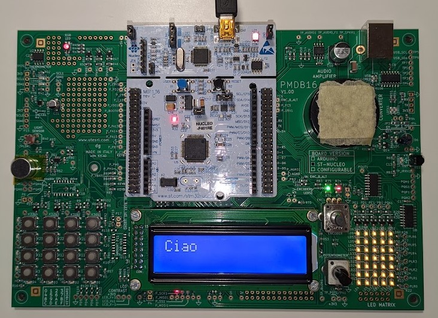

# Sensor-Systems
STM32CubeIDE projects for the 2024-25 edition of the Sensor Systems course.

Polytechnic of Milan - Prof. Villa Federica, T.A. Laita Gabriele

Group: [Samuele Giammusso](https://github.com/giammu),
 [Tommaso Fellegara](https://github.com/Felle33),
  [Luca Cattani](https://github.com/SigCatta),
   [Manuela Marenghi](https://github.com/manuelamarenghi),
    [Daniel Csata](https://github.com/csatadani)

## Useful Informations and Files
For every project, you can find the main.c in the folder: projectName/Core/Src/main.c

[Cheatsheet](reports/Cheatsheet_Sensor_System.pdf) for the lab part of the oral exam

[STM32F401RE](documents/Nucleo_Schematic.pdf) microcontroller schematic

[Expansion board](documents/Hands-on_Lab_Schematics.pdf) schematic

[Matlab](matlab) scripts for communicating with the board

[LCD](lcd) display files

## Laboratory 2 - GPIO and Interrupts

[project 1a](projects/lab_02): turn on the led by pressing the button. The code is written in the while loop

[project 1b](projects/lab_02_v2): turn on the led by pressing the button. The code is written in the callback

[project 1c](projects/HW_02_v2): led blink at 1 hz using pwm

[homework prj](projects/HW_02): led on/off when there is an interrupt on the microphone

- [Report](reports/Homework02_B5.pdf) for the homework

## Laboratory 3	- Timers, speaker and microphone

[project 2](projects/lab_03): play a note through the speaker

[project 2c](projects/HW_03_v2): play a song when there is an interrupt on the microphone, using timer interrupts

- [Report](reports/Homework03_B5.pdf) for the homework

- [Excel file](excel/03%20-%20Musical%20note.xlsx) for parameter computation for PWM notes 

## Laboratory 4 - USART and LCD
	
[project 1](projects/lab_04): communication UART from the board to Matlab

[project 2](projects/HW_04_fixed): communication with UART DMA from board to pc
	
[homework prj](projects/HW_04_v2_fixed): use the LCD to show the names in circular order
	
- [Report](reports/Homework04_B5.pdf) for the homework

## Laboratory 5 - ADC and potentiometer

[project 1](projects/lab_05): acquire the voltage of the potentiometer with ADC every 1 sec and display it on MATLAB. Use the ADC in polling mode with single acquisition

[project 2a](project/lab_05_2a): like prj 1, but with ADC in interrupt mode

[project 2b](projects/HW_05_2b): like prj 2a, but the ADC is triggered by the Timer (TRGO)

[project 2c](projects/HW_05_2c): like prj 2b, but instead of using UART, display it on the LCD

[homework](projects/24.UART2LCD): communication UART DMA from Matlab to LCD

- [Report](reports/Homework05_B5.pdf) for the homework

## Laboratory 6 - ADC and LDR
	
[project 3a](projects/lab_06_3a): ADC acquire 3 voltages (potentiometer, temperature sensor, Vref) and send to pc via UART DMA

[project 3b](projects/HW_06_3b_v2): acquire the LDR (light dependent resistor) with ADC half conversion complete callback

- [Report](reports/Homework06_B5.pdf) for the homework

## Laboratory 7 - I2C and Temperature Sensors

[project 1](projects/lab_07): I2C read the MSB of the bandgap temperature sensor

[project 1b](projects/HW_07): read MSB and LSB, version LM75 of the sensor, and send it via UART DMA

[project 1b alternative](projects/HW_07_B): read MSB and LSB, version LM75B of the sensor, and send it via UART DMA

- [Report](reports/Homework07_B5.pdf) for the homework

## Laboratory 8 - Accelerometer
	
[project 01a](projects/lab_08): read the accelerometer with I2C, and send it via UART

[project 01b](projects/HW_08): read accelerometer using timer interrupts, and send it via UART DMA 
	
[project 01c](projects/HW_08_c): read accelerometer using timer interrupts, using I2C DMA, and send it via UART DMA

- [Report](reports/Homework08_B5.pdf) for the homework

## Laboratory 9 - SPI and LED

[project](projects/lab_09): use SPI to activate the LED matrix

[homework](projects/HW_09): like the previous project, but with DMA of SPI
	
- [Report](reports/Homework09_B5.pdf) for the homework

- [Excel file](excel/LED%20matrix%20computation.xlsx) for generating coordinates for the LED matrix 

## Laboratory 10 - Keyboard and Encoder
	
[project 1](project/lab_10_v1): keyboard readout using timer interrupt

[homework](project/HW_10_v1): encoder readout with a timer and transfer with UART DMA
	
- [Report](reports/Homework10_B5.pdf) for the homework

## Laboratory 11 - IR
	
[project 3](project/lab_11_transmit): infrared transmit and receive in the same board

You can find the report for the infrared communication at the end of the CheatSheet
	